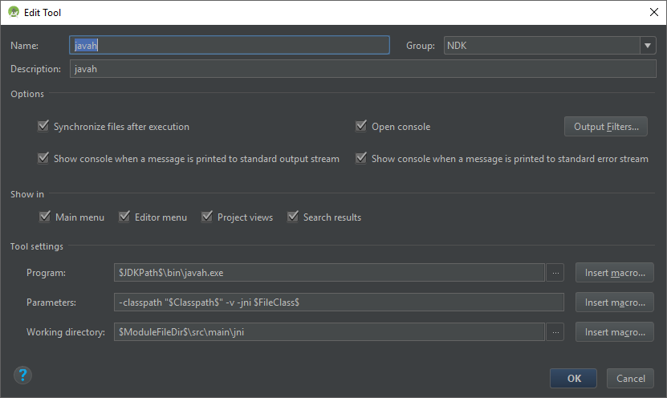
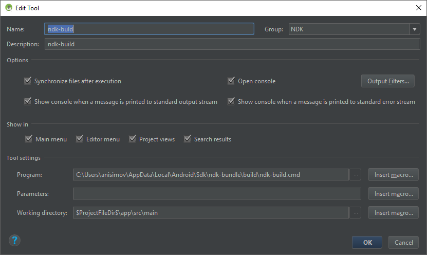
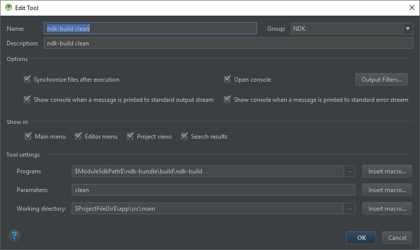
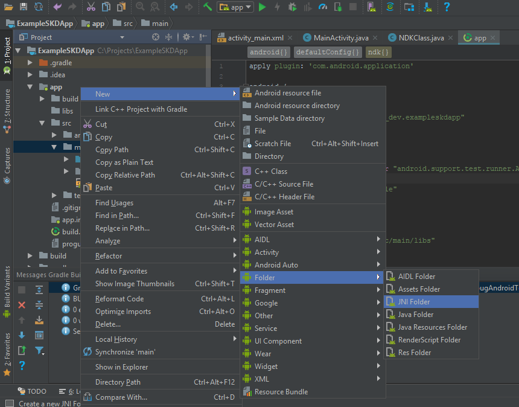
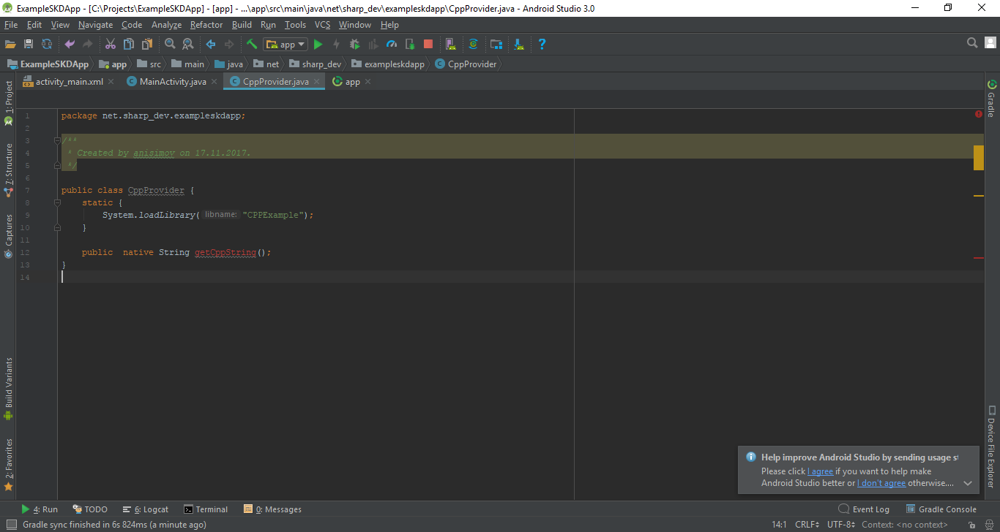
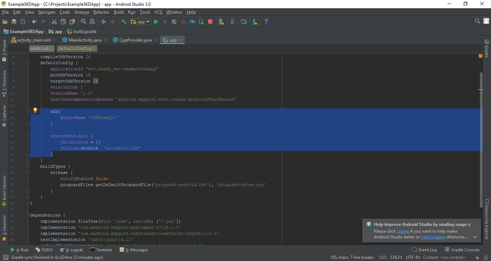
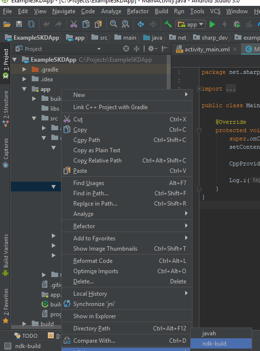

# Android NDK и OpenCV (С++) на Java Android (Windows 10)
Данный гайд расчитан на разработку в Android Studio.
0. Установить Android SDK и Android NDK
0. Открыть Android Studio -> Tools -> Android -> SDK manager
0. Открыть вкладку SDK Tools
0. Поставить CMake, LLDB. Проверить, что NDK на месте
0. В Project Structure проверить, что пути до SDK, JDK и NDK верные.

Следующий шаг нужен для удобного использования NDK:

Заходим в Preferences -> Tools -> External Tools и настраиваием такие штуки ( пути должны быть без пробелов в моем случае исходники студии пришлось в С:\AndroidStudio перенести) 

Далее в Project меняем отображение с Android на Project  и в app/src/main добавляем jni директорию как показано на картинке

Создаем класс который будет рабоать с С++

Настраиваем градл  

Не забываем  добавить android.useDeprecateNdk=true  в конец gradle.properties

Билдим проект!

Через контекстное меню  билдим заголовки нашего cpp  класса
![build_cpp_header] (build_cpp_header.png)

В папке jni cоздаем файл C++ подключаем в негосозданные заголовки и определяем  описанноые в заголовках методы
![cpp_defenition] (cpp_defenition.png)

В той же папке содаем файл Android.mk с содержимым:

LOCAL_PATH := $(call my-dir)

include $(CLEAR_VARS)

LOCAL_MODULE := ${Название Вашего класса} 
LOCAL_SRC_FILES := ${Название Вашего класса с разширением}
include $(BUILD_SHARED_LIBRARY)

В той же папке содаем файл Application.mk с содержимым:

APP_MODULES := ${Название Вашего класса}

APP_ABI := all

Далее черз контекстное меню на папке jni билдим ndk-build
   

Запускаем приложение  и радуемся)))

